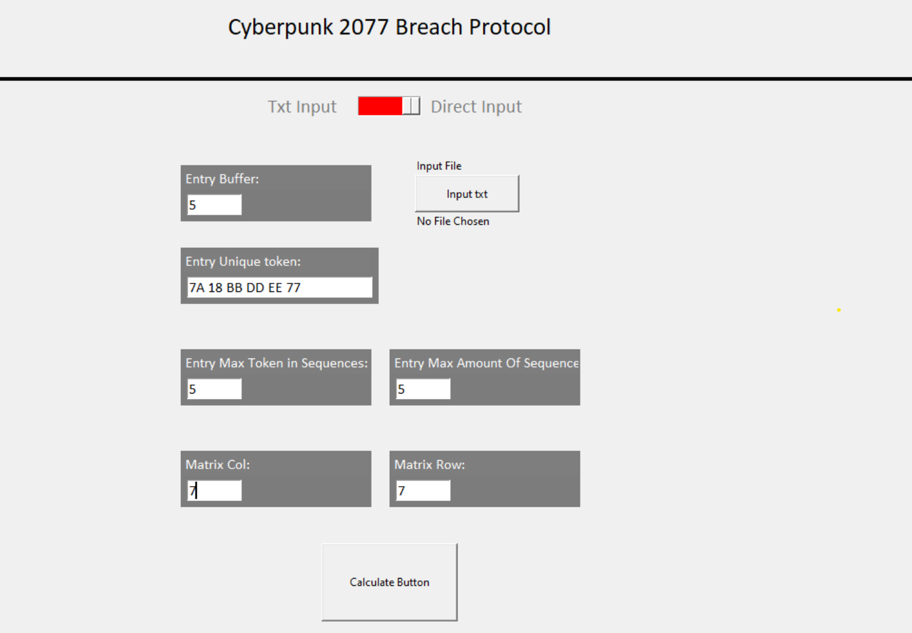
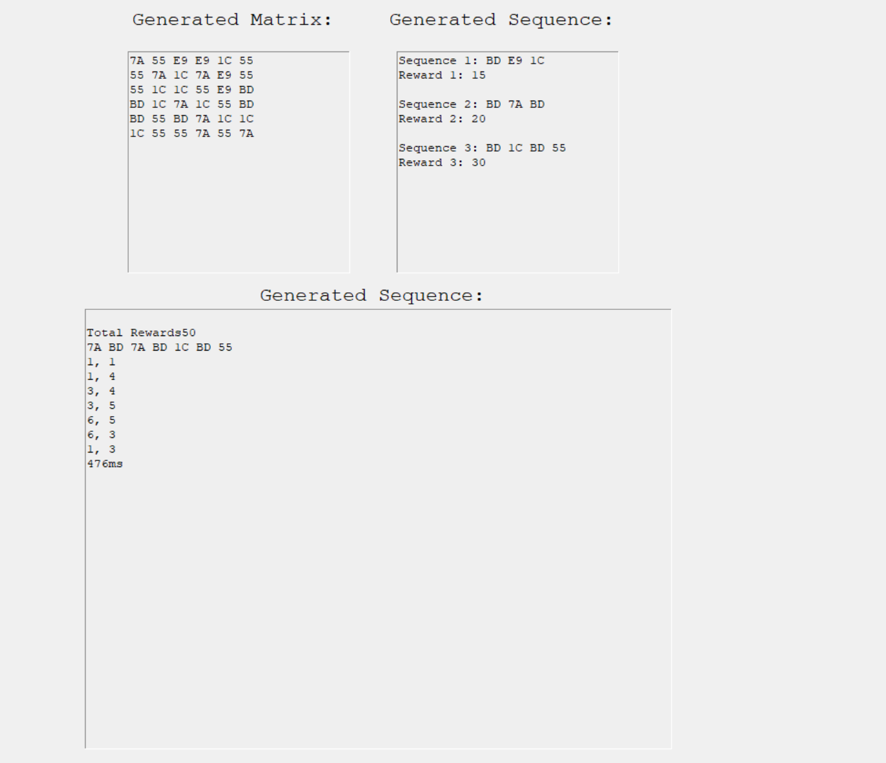

# Cyberpunk 2077 Breaching Protocol Solving Algorithm
> Tucil 1 Stiima, Cyberpunk 2077 Breaching Protocol Solving Algorithm

> Program untuk menjalankan simulasi minigame pada game Cyberpunk 2077 bernama Breaching Protocol Solving Algorithm yang bertujuan melatih penggunaan Brute Force Algorithm dalam pemecahan suatu permasalahan

> 

# Table Of Contents
* [General Inforamation About The Program](#Information)
* [Technology Involved in the Project](#Technology-Involved)
* [How to use](#how-to-use)
* [Features](#Features)
  
## Information
- A website that can do a data similarity checking of a dataset and an input image
- This website is a starter for us to learn a machine learning as how it works is basically the smae
- This website is also a task completion of a geometrical Algebra 

## Technology-Involved
? Mainly using Python

## How To Use
- there are 2 ways to run the program. each have their own
- to run the GUI, run on GUI.py, make sure to install all the needed dependecies. to make sure, try pip install requirement.txt on the src directory to install all my installed package
- to run the CLI version, run python on main.py
## Features
- Input using txt file for CLI
- Input using directly input on the CLI to get all the data randomly
- Input using txt file for GUI
- Input using directly input on the given space on the GUI
